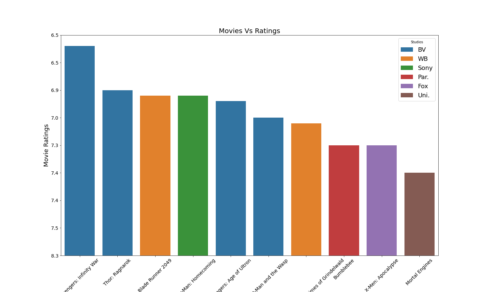
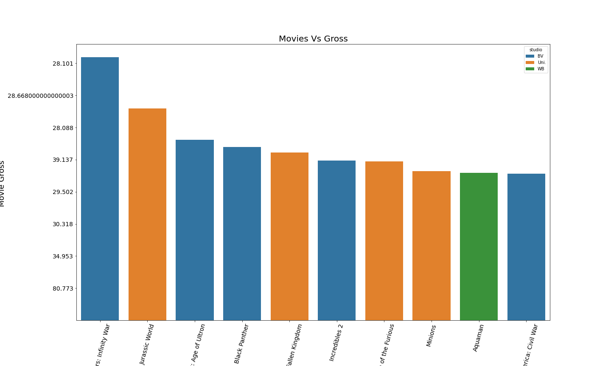
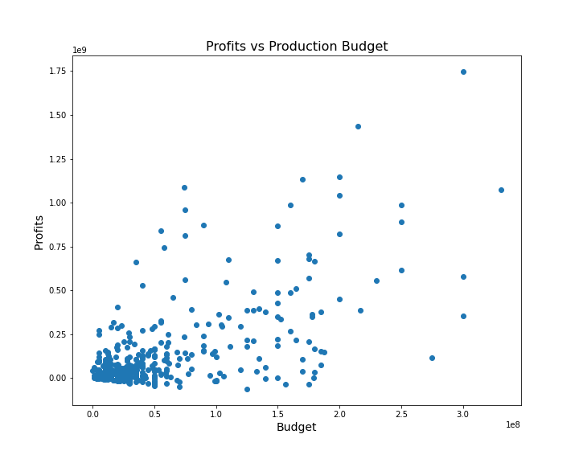
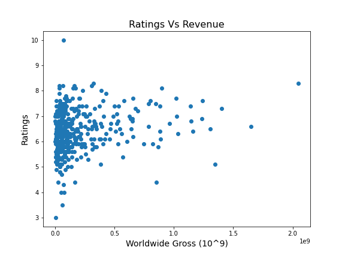
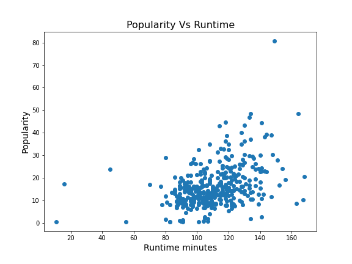

# Introduction

## Overview

The main goal of the project is to come up with insights to help Microsoft start and excel in the movie business.We will use exploratory data analysis to come up with actionable insights to help decide what type of films Microsoft should create.

# 1.2 Objectives

## 1.2.1 General objectives

Explore and analyze the types of films that are currently doing the best at the box office and using the findings to help decide the types of films to create

## 1.2.2 Specific objectives

i. Loading datasets into pandas
ii. Retrieving data from a DataFrame
iii. Data preparation annd cleaning
iv. Exploratory analysis
v. Data visualization

# 1.3 Questions to answer

The analysis below should be able to answer the following questions:

1. What are the popular genres in the box office?
2. What are the most popular studios with high world-wide gross?
3. Does popularity affect the worldwide gross?
4. Does budget affect revenue?
5. Does rating affect revenue?
6. Does popularity affect the rating?
7. Does the runtime minutes affect the ratings?
8. Does runtime minutes affect the popularity?

# 2. Data Understanding

## 2.1 The Data

The datasets are stored in the 'zippedData' folder which were sourced from:

- Box Office MojoLinks
    - bom.movie_gross.csv
- IMDBLinks
    - im.db
- Rotten TomatoesLinks
    - rt.movie_info.tsv
- TheMovieDBLinks
    - tmdb.movies.csv
- The Numbers
    - tn.movie_budgets.csv

## 2.2 Importing the relevant libraries

Begin by importing pandas, numpy, csv with their aliases

#Your code here - remember to use markdown cells for comments as well! 
#importing libraries
import pandas as pd br
import sqlite3
import csv
import numpy as np
from datetime import datetime
#importing data visualisation tools
import matplotlib.pyplot as plt 
import seaborn as sns

%matplotlib inline

### 2.2.1 Loading the datasets
To load the data use:

- movies_budget = pd.read_csv('zippedData/tn.movie_budgets.csv')
- movies_gross = pd.read_csv('zippedData/bom.movie_gross.csv')
- tmd = pd.read_csv('zippedData/tmdb.movies.csv',index_col=0)
- reviews = pd.read_csv('zippedData/rt.reviews.tsv', delimiter='\t',encoding='unicode_escape')
- conn = sqlite3.connect('zippedData/im.db')
- movie_info = pd.read_csv('zippedData/rt.movie_info.tsv', delimiter ='\t', encoding='unicode_escape' )

## Screenshots

## Conclusion

1. Movies with a high budget make more profits as compared to those with a low budget.
2. High rated movies gross higher, hence high profit margins.
3. Popular movies have high ratings
4. Drama, Comedy and Action genre of movies are the best to venture into since they are the popular genres

## Recommendation

1. Microsoft should come up with movies that incorporate drama and comedy.
2. Microsoft can benchmark from BV and … since they produce high ranking and grossing movies.
3. Microsoft should come up with a strong marketing strategy since popularity increases the ratings and profits.
